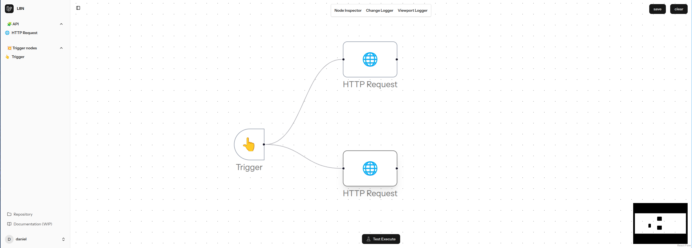

# l8n



## Project Overview

I started this project to understand how something like n8n works, and I wanted to recreate it using Laravel, hence the name of the project, l8n.

## Current Status

- **Version**: v1.0
- **Supported Nodes**: Currently, only two nodes are supported: `Trigger Node` and `HTTP Request Node`.
- **Known Issues**: A significant problem is that when execution is done on the backend, the result is sent to all nodes, which is not the desired behavior. However, it is sufficient for a proof of concept.

## Todos

- **Immediate Focus**: Fix the issue of sending results to all nodes as quickly as possible.
- **Enhancements**: Add more nodes. (Edit, filter, google docs, google sheets, etc)
- **Testing**: Write tests 😄.

## Contribution

The code is not clean by any stretch of the imagination, but it will get better for sure. If you have any suggestions, please contribute to the project or let me know where I am wrong.

Steps to run the project:

```bash
git clone https://github.com/DanielHemmati/l-8-n.com
cd l-8-n.com
composer install
npm install
npm run dev && npm run build
docker compose up -d
composer run dev
```

Work on your own branch and create a pull request to the main branch.

## License

This project is licensed under the MIT License - see the [LICENSE.md](LICENSE.md) file for details.

